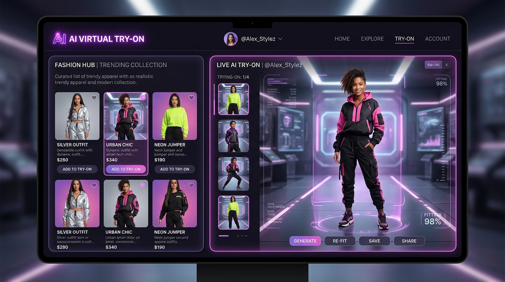

# AI Virtual Try-On Chrome Extension

> A Chrome Extension that lets you virtually try on clothes, shoes, and accessories from any online shopping website using AI.



## 🚀 Quick Start

### 1. Deploy Backend to Vercel

```bash
cd backend/
npm install
npx vercel login
npx vercel deploy
```

Add `GEMINI_API_KEY` as an environment variable in your Vercel project settings.

### 2. Update Backend URL in Extension

Edit `extension/popup.js` line 4:
```javascript
const BACKEND_URL = 'https://your-project.vercel.app';
```

### 3. Load Extension in Chrome

1. Open `chrome://extensions`
2. Enable "Developer Mode"
3. Click "Load Unpacked" → select `extension/` folder

### 4. Set Up Profile & Try On!

Click the extension icon → upload photos → browse a shopping site → scan → try on!

---

## 📁 Project Structure

```
├── extension/           # Chrome Extension (MV3)
│   ├── manifest.json
│   ├── popup.html/css/js
│   ├── background.js
│   ├── content.js
│   └── icons/
├── backend/             # Vercel Serverless Backend
│   ├── api/
│   │   ├── tryon.js    # AI try-on endpoint
│   │   └── index.js    # Health check
│   ├── package.json
│   └── vercel.json
├── website/             # Landing Page
│   └── index.html
└── USER_GUIDE.md        # Complete user documentation
```

## 📖 Documentation

See [USER_GUIDE.md](USER_GUIDE.md) for complete setup and usage instructions.

## 🛠️ Tech Stack

- **Chrome Extension**: Manifest V3, Content Scripts, Service Worker, Chrome Storage API
- **AI Backend**: Node.js, Vercel Serverless Functions
- **AI Model**: Google Gemini 2.0 Flash (multimodal image generation)
- **Product Detection**: JSON-LD, OpenGraph, CSS Selectors
- **Storage**: Chrome Local Storage (profile, history)

## 🛍️ Tested On

- Amazon
- Flipkart
- Myntra
- AJIO
- Any Shopify store

## 📋 Assignment Requirements

✅ Chrome Extension (Manifest V3)  
✅ Personal Digital Profile (5 photo types)  
✅ Product Detection (multi-strategy)  
✅ AI Virtual Try-On (Gemini 2.0 Flash)  
✅ 9+ Product Categories  
✅ Cross-website support  
✅ Context-aware visualization  
✅ Try-on History  
✅ Privacy & Security  
✅ Vercel-deployable Backend  
✅ User Guide  
